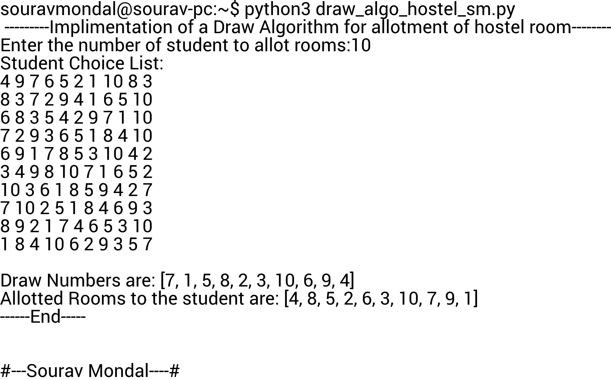

<h1 align="center">Draw Algorithm Project</h1>

<p align="center">
<br>


This is a simple implementation of Pareto optimal and strategyproof solution for priority-based selection using the Draw Algorithm in python3.This program will let you choose hostel rooms depending on your priority and vacant rooms available. On the basis of the true choice of students, they will be rewarded with the best room available depending on their choice.

## How to run

Before running make sure you are having an python installed for windows users or linux users.For windows user just open the file with any python ide and just compile and run.For unix users first navigate to the directory where this ```drawAlgorithm.py ``` file stored and then run the follwoing commands in terminal.

```In linux terminal or windows terminal
python3 drawAlgorithm.py    #For python version above 3
python drawAlgorithm.py    #For python 2.7
```


## Usage

```Python


  def main() : main function which all other from main function

  def drawAlgoithm(studentChoice, finalAllotmentList,n): used as a function for draw algorithm, generates draw number randomly, n is the number of rooms and students to be alloted. where for n student n choices list will be generated randomly via this function call
  
  def generateStudentChoice(n): Generates students choice list for n students randomly

  def sortDrawList(choiceWithDrawNum):  Sorting student choice list according to the draw numbers
  
  def randomNumbers(Numbers, size): Suffle and retuns a random drawNumber from the drawNumbersList
```

## Contributing
Pull requests are welcome. For major changes, please open an issue first to discuss what you would like to change.

Please make sure to update tests as appropriate. Feel free to contact here: souravmondal0341@gmail.com

## Update
Two sided matching algo will be updated soon.

## Credits
[Sourav Mondal](https://github.com/souravmondaldev)
